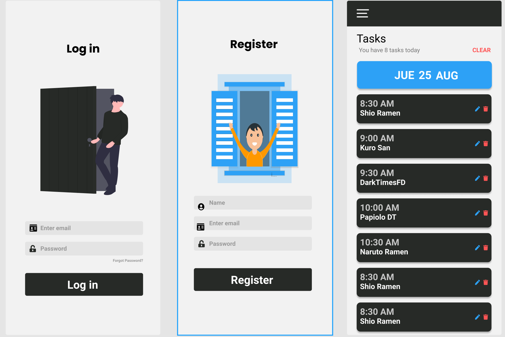

# TuTiempo

TuTiempo es una aplicacion hecha para barberos y salones para que puedan guardar informacion sobre la hora que el cliente tiene una cita

Format: 

#   Things to do this week

#    Tuesday: Form validation
[ ] create helper folder 
[ ] develope a validator helper class
[ ] use validator helper class to validate TextFormFields
[ ] Nest TextFormFields inside a form
[ ] manage form validation on submit, thist should be done either on createUserMethod, or logging in    
                method
[ ] Fix, TextFormFields: KeyboardInputActions

#    Thursday: Animations
[ ] Learn about flutter animation
[ ] Decide on a tool to animate or do it natively 
[ ] implement swipe to delete with animation
[ ] display number of task based on task length 
[ ] Work on the config file: set up app Theme, Color Pallete, TextThemes
[ ] create settings page